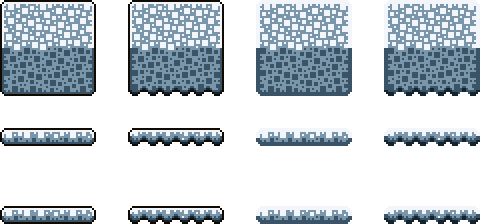

# platform-pixel

An agent skill for [Cursor](https://cursor.com) and other tools that load `SKILL.md`. It remaps 16×16 platformer tiles from a JSON palette. Identity is **shape + palette**, not a prompt. It writes sliced tiles plus one atlas. It does not build levels or characters.

## Example: snow

[`examples/snow/`](examples/snow/) is a winter kit (icy highlight / packed snow / cold shadow). Default build packs thick 3×3 and thin 1×3 platforms, flat and wavy undersides, black rims and inner-color rims, with one empty cell between groups.


Rebuild it:

```bash
python .cursor/skills/platform-pixel/scripts/build.py --palette snow --out examples/snow
```

## 16 / 32 / 64 cells

Seeds and QA stay **16×16**. `--cell 32` and `--cell 64` nearest-neighbor scale after QA (`×2` / `×4`, `Image.NEAREST` only). Each source pixel becomes a 2×2 or 4×4 block. That is the same silhouette with fatter pixels — not a native 32/64 redraw, and not Lanczos / bilinear / bbox-fit.

Gutter is still **one output cell** (16, 32, or 64 px). Put 32/64 kits in their own `--out` folder so they do not mix with 16px slices.

```bash
python .cursor/skills/platform-pixel/scripts/build.py --palette snow --cell 32 --out examples/snow-32
python .cursor/skills/platform-pixel/scripts/build.py --palette snow --cell 64 --out examples/snow-64
```

Atlas size at the default 15×7 pack: 240×112 (`16`), 480×224 (`32`), 960×448 (`64`). The JSON records `cell`, `source_cell: 16`, `scale`, and `resample: nearest`.



## Install

```bash
git clone https://github.com/francsun/platform-pixel.git
cd platform-pixel
pip install -r requirements.txt
```

Copy the skill into the agent folder your tool reads:

```text
your-game/.cursor/skills/platform-pixel/   # Cursor
your-game/.codex/skills/platform-pixel/    # Codex
```

Keep this clone on disk. The script looks for `tileset-training/` here (or `PLATFORM_PIXEL_ROOT`). Then ask the agent for a snow platform or a new palette.

## What it outputs

| File | |
|---|---|
| `{name}.png` | Atlas on the output cell grid (default 240×112 at `--cell 16`) |
| `tiles/*.png` | Chunky 3×3 slices |
| `tiles_tiny/*.png` | Tiny 1×3 slices |
| `{name}.json` | Palette, layout, `cell` / `source_cell` / `scale` / `resample` |

Defaults: `--shape both` (flat + wavy), `--outline both` (ink rim + fill rim), `--family all` (chunky + tiny), `--cell 16`.

## Seeds

Training art lives in [`tileset-training/`](tileset-training/). Do not invent a third silhouette; recolor `block` / `tufted` only. Grammar: [`.cursor/skills/platform-pixel/grammar.md`](.cursor/skills/platform-pixel/grammar.md).
